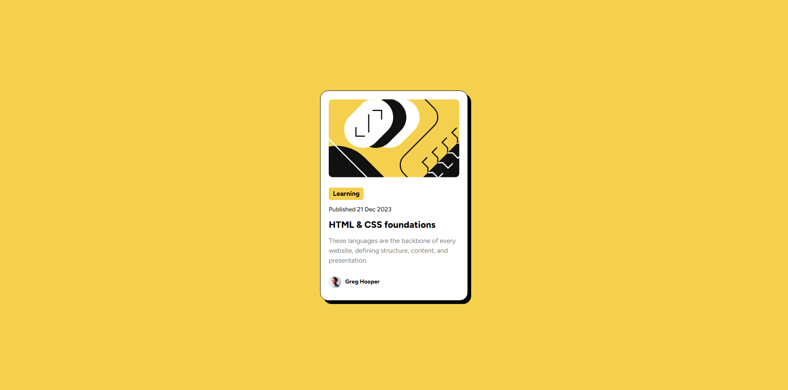

# Frontend Mentor - Blog preview card solution

This is a solution to the [Blog preview card challenge on Frontend Mentor](https://www.frontendmentor.io/challenges/blog-preview-card-ckPaj01IcS). Frontend Mentor challenges help you improve your coding skills by building realistic projects. 

## Table of contents

- [Overview](#overview)
  - [The challenge](#the-challenge)
  - [Screenshot](#screenshot)
  - [Links](#links)
- [My process](#my-process)
  - [Built with](#built-with)
  - [What I learned](#what-i-learned)
  - [Continued development](#continued-development)
  - [Useful resources](#useful-resources)
- [Author](#author)
- [Acknowledgments](#acknowledgments)


## Overview

### The challenge

Users should be able to:

- See hover and focus states for all interactive elements on the page

### Screenshot




### Links

- Solution URL: (https://www.frontendmentor.io/solutions/blog-preview-card-FaHfJ7U-39)
- Live Site URL: (https://blog-preview-card-eye0001.netlify.app/)

## My process

### Built with

- Semantic HTML5 markup
- CSS custom properties
- Flexbox

### What I learned

I learned how to use @font-face to download fonts right into your project.

```css
@font-face {
    font-family: 'Figtree';
    src: url(assets/fonts/Figtree-VariableFont_wght.ttf)
}
```

### Continued development

I would like to continue development with flexbox to design my projects.

## Author

- Frontend Mentor - [@Eye0001](https://www.frontendmentor.io/profile/Eye0001)

